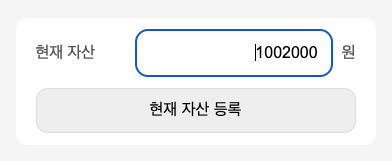

# 가계부

## Use Case

1. 현재 자산을 입력할 수 있다.
2. 가계부 내역을 입력할 수 있다.
3. 가계부 목록을 볼 수 있다.

## Detail

가계부 내역 데이터

```json
{
	"currentFunds": 1000000,
}

// 가계부 내역
{
	"id": "...",
	"category": "coffee" | "meal" | "shopping" | "mart",
	"description": "블라블라",
	"amount": 1000,
	"createAt": "2023-01-11T05:01:39.258Z",
  "fundsAtTheTime": 100000, // 시점 잔액
}[]
```

### 데이터 관리

> 원본데이터는 브라우저 storage에서 관리


> 데이터 갱신 flow


---

### usecase1) 현재 자산을 입력할 수 있다.



UI

- 총 자산 금액 입력 input
- 제출 버튼

Action

- 금액 데이터 입력
- 버튼 클릭시 데이터 저장

---

### usecase2) 가계부 내역을 입력할 수 있다.


UI

- 소비 카테고리 입력 input
- 소비 내용 입력 input
- 소비 금액 입력 input
- 제출 버튼

Action

- 소비 카테고리 입력
- 소비 내용 입력
- 소비 금액 입력
- validate
  - 소비 금액은 현재 자산 이하
  - 필수값) 모든 내용을 입력 필요
- 버튼 클릭시 데이터 저장

---

### usecase3) 가계부 목록을 볼 수 있다.


UI

- 소비 항목이 나열된 목록

TODO

- 항목의 시간 포맷 변경: `HH:mm`
- 오름차순으로 목록 나열
- 포맷 맞춰주기

---

### 소비내역을 삭제할 수 있다.

UI

- 소비 항목마다 삭제 버튼
